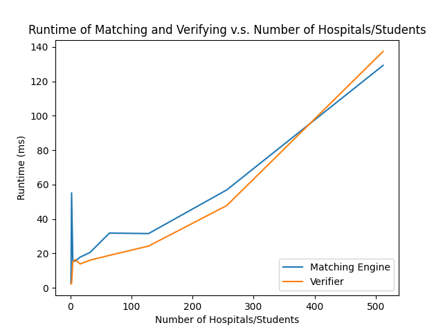

# gale-shapley
Programming Assignment 1: Gale-Shapley Algorithm

This project implements the Gale-Shapley algorithm for the hospital-student stable matching problem, along with a verifier that checks whether a proposed matching is valid and stable.

## Team
1. Evelyn Colon, UFID: 46048391
2. Imaan Edhi, UFID: 28443010

## Project Structure
```bash
examples/
  example1.in
  example1.out
  example2.in
  example2.out
  example3.in
  example3.out
  example4.in
  example5.out
  invalid_duplicate_hospital.out
  invalid_duplicate_student.out
  invalid_example.out
  invalid_missing_hospital.out
  invalid_out_of_range.out

src/
  matcher.py # Gale-Shapley matching engine
  utils.py # Parsing and verification logic
  main.py # Command-line interface
  analysis.py # Part C scalability testing

tests/
  pref_lists/ # Generated preference files for Part C
  matchings/ # Output matchings for Part C
  plot.png # Runtime graph
```

## Requirements
- Python 3.8 or higher  
- matplotlib (only required for Part C)

To install matplotlib:

```bash
python3 -m pip install matplotlib
```
On macOS (if pip is blocked):
```bash
brew install python-matplotlib
```

## How to Run
### Run the Matching Algorithm (Task A)
```bash
python3 src/main.py match examples/example1.in
```

This generates:
```plaintext
examples/example1.out
```

You can also choose other example files to run (with a `.in` extension), or create your own and place them in `examples/`.

### Run the Verifier (Task B)
```bash
python3 src/main.py verify examples/example1.in examples/example1.out
```


Possible outputs:

```plaintext
VALID STABLE

INVALID (with reason)

UNSTABLE (with blocking pair)
```

Example invalid test:

```bash
python3 src/main.py verify examples/example1.in examples/invalid_duplicate_student.out
```

You can also choose other example files to run (with a `.in` and `.out` extension for preferences and matchings, respectively), or create your own and place them in `examples/`.

### Run the Analyzer (Task B): Optional

If you would like to run the analyzer, make sure you have **matplotlib** installed:

```bash
python3 -m pip install matplotlib
```

On macOS (if pip is blocked):
```bash
brew install python-matplotlib
```

To run the analyzer:

```bash
python3 src/analysis.py
```

This will run the Task C experiments and generate the graph.

## Assumptions

Input format:

```plaintext
n
hospital preference lists (space-separated numbers)
student preference lists (space-separated numbers)
```

- **Note:** Empty files are handled.

- Rankings are strict permutations of 1..n

- File I/O time is included in runtime measurements

- Matcher and verifier are tested on the same generated inputs

## Part C Graph and Solution (Conclusion)
From the generated graph, we observe:

- The matching algorithm grows approximately O(n²), which matches the theoretical time complexity of the Gale-Shapley algorithm.
- The verifier shows similar quadratic growth since it must check all possible blocking pairs.
- Both implementations scale predictably and perform efficiently for moderate input sizes up to n = 512.
- These results confirm the expected theoretical behavior.


# small edit
